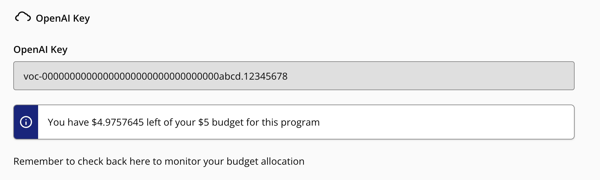

# Vocareum OpenAI API Key

## What Are Vocareum OpenAI API Keys?

OpenAI API keys provide access to paid OpenAI services. Vocareum is a provider that Udacity uses to grant learners access to these keys as part of enrolling in a Udacity program.

Unlike API keys that come directly from OpenAI, Vocareum OpenAI API keys must be routed through Vocareum servers, allowing Udacity to manage API usage budgets.

## Finding Your Vocareum OpenAI API Key

You will find this on the “Cloud Resources” button on the navigation pane. By clicking into the “Cloud Resources” button, you will be provided with a OpenAI API key along with the budget assigned to that key.



## Your Budget

As you use up the credits, you can come back to that screen to see how much budget you have left. Note that while the key may appear at the lesson level, this budget may be shared across the broader Udacity program (course or Nanodegree program).

The budgets are set to align with the demos, exercises, and projects in the program. To avoid prematurely running out of your budgeted credits, do not use models or endpoints beyond those indicated in the program content.

## Using Vocareum OpenAI API Keys

Code that uses Vocareum OpenAI API keys must include the appropriate configuration so the requests are routed to the Vocareum server.

The Python code for this configuration depends on the version of the `openai` package being used. The following examples use a placeholder example API key, which must be replaced with your actual key.

### OpenAI Python Package Version 0

```python
import openai
openai.api_base = "https://openai.vocareum.com/v1"
openai.api_key = "voc-00000000000000000000000000000000abcd.12345678"
```

### OpenAI Python Package Version 1

```python
from openai import OpenAI
client = OpenAI(
    base_url = "https://openai.vocareum.com/v1",
    api_key = "voc-00000000000000000000000000000000abcd.12345678"
)
```

## REST API Calls

If using curl or another client to access the OpenAI API, build the URLs using <https://openai.vocareum.com/v1> in place of <https://api.openai.com/v1>.
